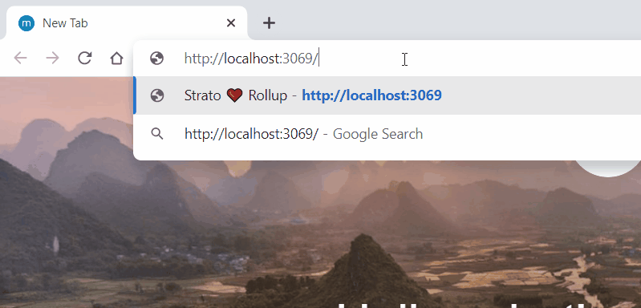

### Demo of bundling Hedera Strato with Rollup


For more info, please check [our official docs on bundling](https://hsj-docs.buidlerlabs.com/markdown/guides/bundling) and be sure to [join our Discord channel](https://discord.gg/4mYCre869F) for any Strato-related talks.

### DIY-ing
Before running, have a `.env` file defined (see [.env.sample](.env.sample)) with a minimum of network credentials to be able to run this locally. Then just

```
$ npm install
$ npm run build
$ npm start
```
and of you go!